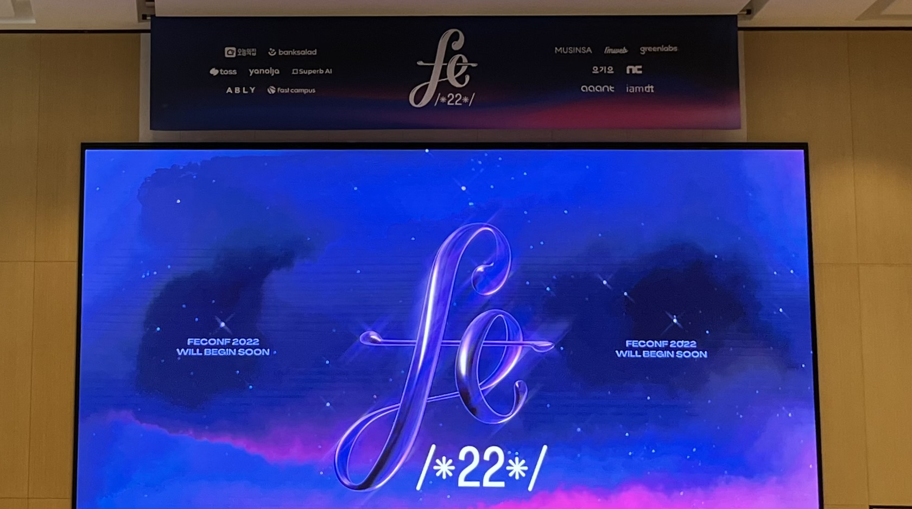

## FEConf 2022

10월 8일 토요일 FEConf 2022에 다녀왔다. Track A와 Track B 두군데로 나뉘어서 세션이 진행되었는데 나는 Track B에서만 처음부터 끝까지 들었다. 

 

## UX 개발자, 대형 서비스 빠르게 프로토타입하기 (구글검색 - 박신연)

> [세션 링크](https://www.youtube.com/watch?v=GF_3kGzJpCA)

### 강연 내용

> 강연 목적 : 대형 서비스는 각각 영역을 담당하는 개발팀이 있으며, 종합적인 업데이트 하기 위해서는 그 팀들과 협업을 해야 한다. 따라서 빠르게 프로토타이핑하고 테스트해야할 경우의 팁을 공유하고자 한다.
- UX 개발자 : 디자인과 사용성에 집중하는 개발자 & 개발자의 언어를 구사하는 UXER
- 프로토타입 : 전체적인 기능을 간략한 형태로 구현한 시제품
- 다른 팀과 의사소통을 효과적으로 하며, 작고 빠른 실패, 작고 소중한 것 → Don’t work hard, work smart
- Pretotype, Design Prototype, Dev Prototype
  - Pretotype : 프로토타입 만들기 전
    - [오즈의 마법사 체험](https://www.simpleusability.com/inspiration/2018/08/wizard-of-oz-testing-a-method-of-testing-a-system-that-does-not-yet-exist/) : speech 서비스를 만들기 전에 옆 방에서 몰래 숨어서 고객의 말 받아적어서 따라 말함. 전혀 개발 시작조차 안 했을 때 있는 척
  - 디자인 프로토타입 : 프레젠테이션(클릭으로 화면 전환), 모션 디자인 툴, 피그마 등 사용
  - 개발 프로토타입 : 디자인 프로토타입으로 구현 불가능한 기술을 포함. 실제 프로덕트의 데이터를 이용하고 복잡한 모션을 포함하며 제품 센서의 정보를 이용하고, 새로운 상호작용(interaction)을 제안하는 것
- UX 개발 프로토타입의 종류
  - Mock-up Environment(목업 환경) : 특정 부분이나 기능만 구현하여 테스트하는 경우이며, 나머지는 이미지로 대체
  - Components Environment(컴포넌트 환경) : 데이터 반영이 필요하고, 그 외의 이미지로 대체 불가능한 경우 (실제와 같은 사용감이 필요할 때)
  - Production Environment(실제 환경) : 사이트의 UI를 바꿔야했는데, 직접 사이트를 만들지 않고 크롬 익스텐션을 개발해서 진행

### 느낀점

너무너무 재밌었다! 발표하시는 분이 설명을 너무 즐겁게 해서 제일 재미있게 들었다.
UX 개발자는 처음 들어봤는데 확실히 클라이언트단은 빠르게 만들어보는 것이 중요한 것 같다. 개발자는 단순히 개발을 하는 것보다 문제를 해결하는 사람이라는 말을 많이 들었는데, 세션에서 보여준 예시가 그와 맞는 설명인 것 같다.

 
 

