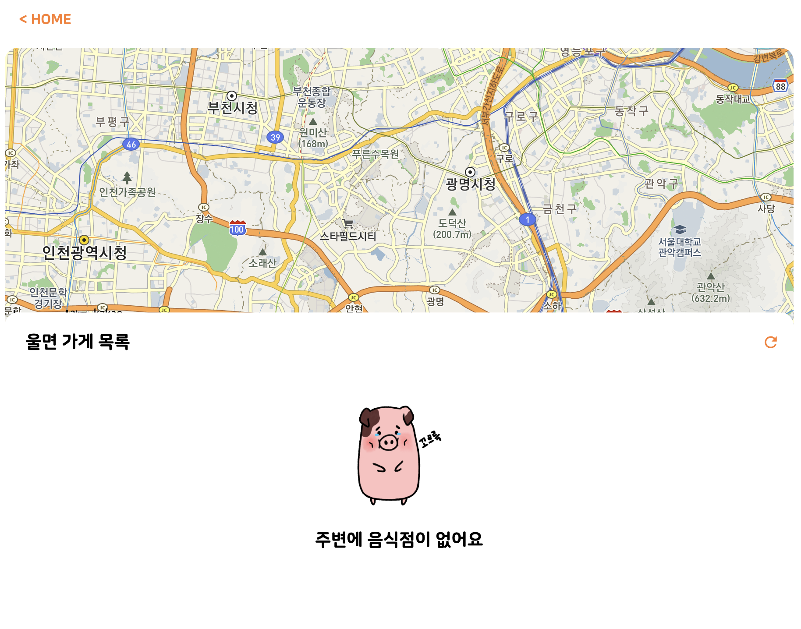
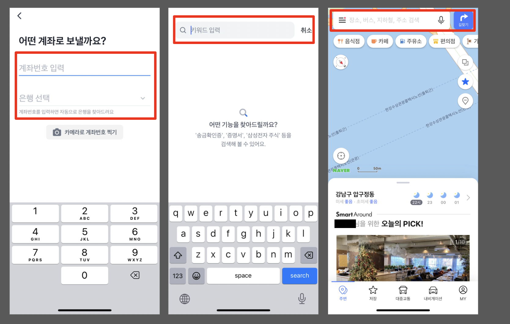
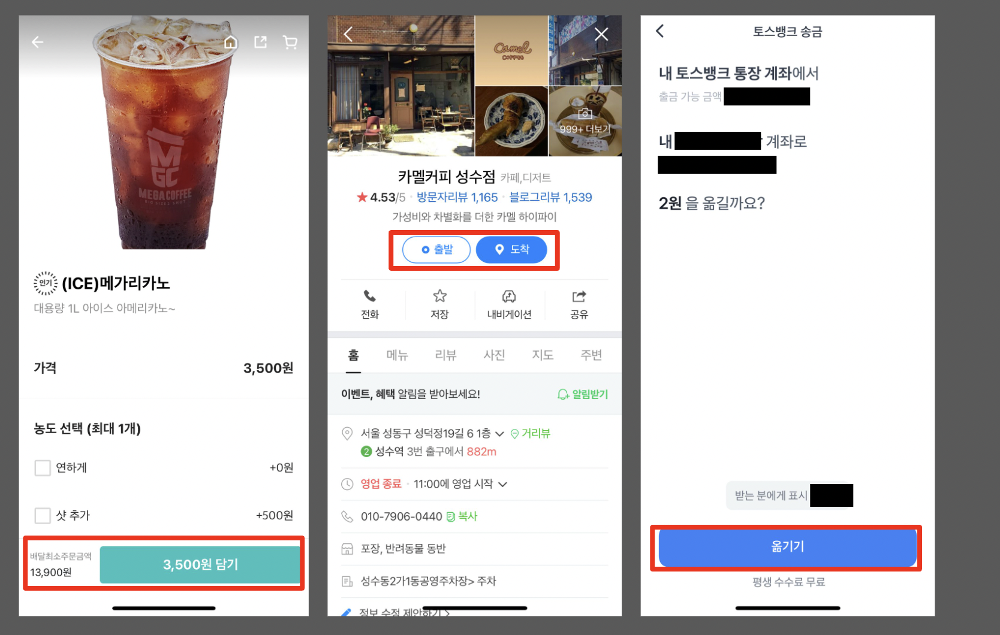
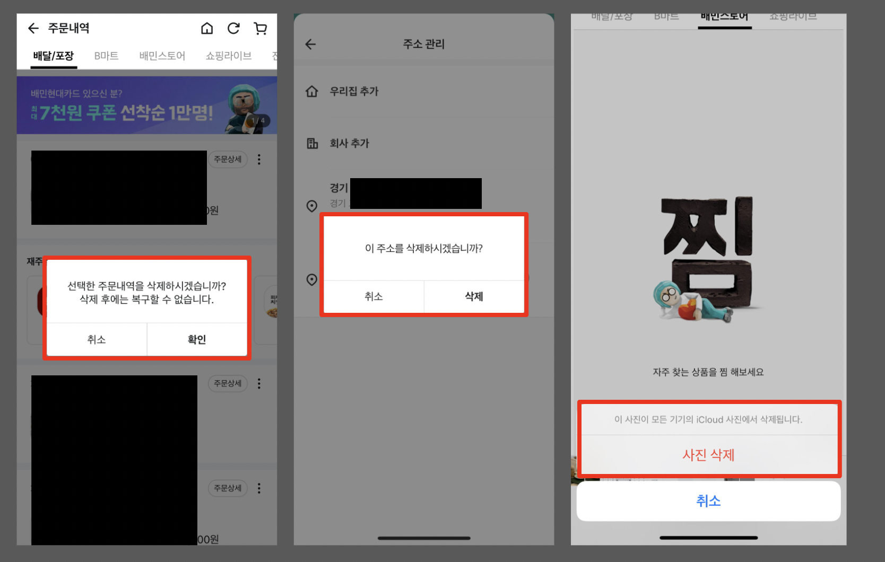
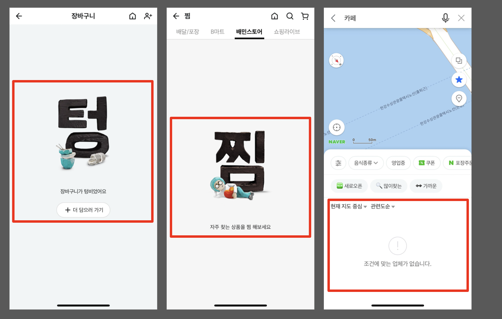

> 강의 [고객의 친구가 되기 위한 'UX Writing'(인프런, 켈리폴리)](https://www.inflearn.com/course/user-friendly-ux-writing)를 보고 작성했습니다

## 강의를 보게 된 계기

작년에 FEConf 2022의 [UX 개발자, 대형 서비스 빠르게 프로토타입하기 (구글검색 - 박신연)](https://www.youtube.com/watch?v=GF_3kGzJpCA) 강연을 흥미롭게 들었다. 이후 토스 블로그에서 [거꾸로 입력하는 가입 화면, 처음에 어떻게 떠올렸을까?](https://toss.tech/article/toss-signup-process) 글을 읽고 나서 UX에 대해 잘 알고 싶어졌다. 학부 때 재미있게 들었던 수업 중 하나가 HCI개론이었는데 원래 이런 쪽에 관심이 있었던 것 같다.  
연말에 UX Writing 강의를 사놓고 미루다가 드디어 완강했다.

 

## 고객의 친구가 되기 위한 'UX Writing'

강의는 크게 3개의 섹션으로 나뉘고, 짧은 편이다.  
`섹션 0. UX Writing`에서는 UX Writing에 대한 소개와 필요성에 대해 알려준다.  
`섹션 1. 상황, 요소별 실제 사례로 Writing 살펴보기`에서는 UX Writing이 적용된 좋은 사례와 나쁜 사례를 여러 개 보여준다. 좋은 사례는 실서비스를 기반으로 보여주고 나쁜 사례는 직접 만든 예시로 보여주는 편이다. 목차는 플레이스 홀더, CTA 버튼(전환 버튼), 확인/취소 안내, 오류 메시지, 빈 페이지로 구성되어 있다.  
`섹션 2. 내 서비스에 UX Writing 적용해보기`에서는 타켓과 상황을 몇 가지 정해 그에 맞는 전략을 보여주고, A/B 테스트에 대해서도 소개한다.

인프런 강의인데 6개월의 기한이 있다. 그리고 강의 pdf 파일은 따로 신청하면 메일로 보내주는 것 같다.

 

## 느낀 점

강의는 UX Writing의 입문용으로 좋은 것 같다. UX Writing에 대해 궁금했는데 실제 예시와 함께 보니까 이해가 더 잘 되었다. 전반적으로 **명확하게 긍정적인 표현을 이용해서 작성하는 것**이 제일 중요한 것 같다.
A/B 테스트의 필요성과 사용자를 분석하는 것의 중요함도 알게 되었고, CTA 버튼이라는 용어도 알게 되었다.  
강의 후반부에 UX Writer로서 개발자에게 분석을 위한 데이터나 테스트를 요구하는 방식에 대한 작은 팁을 주는데 뭔가 신기했다. 특히 나도 한번 작성한 문구는 웬만해선 그대로 두는 편인데 강의에서도 그 부분을 짚어주면서 애초부터 모호한 표현은 지양하라고 해서 앞으론 조심해야겠다고 생각했다.

전에 팀 프로젝트를 진행할 때 질문이나 대답 등 문구를 어떻게 작성해야 할지 고민을 많이 했었다. 당시에는 고민하면서도 이런 문구는 대충 작성해도 사용자가 알아서 이해할 수 있지 않을까, 차라리 코드 짜는 게 더 중요하지 않을까 싶었는데 강의를 듣고 나니 그런 고민이 의미 있고 중요하다는 걸 알게 되었다.

위는 당시 팀 프로젝트 때 만들었던 빈 페이지다. 주변에 음식점이 없다고 나름 잘 알려주었다고 생각하지만 다시 보니 '주변에 울면을 파는 음식점이 없어요'라고 수정해도 괜찮을 것 같기도 하다.

 

## UX Writing의 여러 예시와 자료

> 강의에선 여러 예시들은 아카이빙해놓는 것을 권장한다고 한다.  
> 강의 내용과 관련된 글과 예시를 추가로 찾아 정리했다.

### 플레이스 홀더

플레이스 홀더는 사용자가 어떻게 입력해야 하는지 가이드를 준다. 검색창도 자세히 작성하면 사용자가 어떻게 검색해야하는지 알 수 있다.  

위처럼 입력창이나 검색창에는 자세히 적어놓으면 사용자가 어떻게 입력할지 알 수 있다.

### CTA 버튼(전환 버튼)

CTA 버튼은 `Call To Action`의 약자로 사용자의 반응 또는 즉각적인 판매를 유도하는 행위나 문구를 말한다. CTA 버튼을 통해 사용자는 해당 버튼을 클릭했을 때 어떤 일이 일어나는지 예측할 수 있다.  

위처럼 버튼을 클릭했을 때 어떤 일이 일어날지 자세히 적어놓으면 사용자가 해당 버튼을 클릭했을 때 어떤 일이 일어날지 쉽게 예측할 수 있다.  
그리고 불필요한 버튼은 최소화해야 한다. 토스 블로그의 [2초만에 불필요한 클릭 없애는 4가지 방법](https://toss.tech/article/4-ways-for-minimum-input) 글에서 더 자세히 알 수 있다.

### 확인/취소 안내

확인이나 취소 버튼은 클릭했을 때 돌이킬 수 없다. 따라서 확인 버튼은 클릭했을 때 어떤 일이 일어나는지 명확히 적어놓아야 하고, 취소 버튼은 클릭했을 때 한 번 더 물어봐야 한다.  

위처럼 취소할 때는 한 번 더 물어보는 것이 좋다.

### 오류 메시지

오류 메시지는 왜 오류가 났고 어떻게 해야 오류를 해결할 수 있는지 명확하게 알려주는 것이 중요하다.  
토스 블로그의 [좋은 에러 메시지를 만드는 6가지 원칙](https://toss.tech/article/how-to-write-error-message)에서 더 자세히 알 수 있다.

### 빈 페이지

빈 페이지는 장바구니가 비었거나, 작성한 글이 없어서 목록이 빈 경우를 말한다(처음에는 404 페이지를 말하는 줄 알았다).  
예전에 배달의민족 블로그에서 [미션: 빈화면을 채워라](https://story.baemin.com/3614/) 글을 흥미롭게 읽은 적이 있다. 배달의민족 앱을 사용하다 보면 장바구니가 비었을 때 '텅' 화면을 마주하게 되는데 어떻게 그런 화면을 만들게 되었는지 그 과정에 대해 정리한 글이다.  

위처럼 빈 페이지를 잘 만들어 놓으면 사용자가 이 빈 페이지가 원래 어떤 용도이고 어떻게 해야 채울 수 있는지 잘 알 수 있다고 한다.

### 추가로 함께 보면 좋을 자료

토스 블로그에서 [토스의 8가지 라이팅 원칙들](https://toss.tech/article/8-writing-principles-of-toss) 등 UX Writing 관련된 좋은 글을 읽을 수 있다.  
커리어리에서 UX를 검색해도 [많은 자료](https://careerly.co.kr/search?query=ux&from=open-to-work)가 나온다. 요즘IT에서도 마찬가지로 [여러 자료](https://yozm.wishket.com/magazine/list/search/?q=ux)를 볼 수 있다.  
강의에서 리뷰 화면이 중요하다고 했는데, 마켓컬리 블로그 [후기 개선 프로젝트가 끝이 아닌 시작인 이유](https://helloworld.kurly.com/blog/review-renewal/) 글에서 실제로 리뷰 화면 개선을 진행한 과정을 엿볼 수 있다.  
마지막으로 강의자 켈리폴리님 [브런치 블로그](https://brunch.co.kr/@kellypoly)에서 여러 실서비스 회사 사례를 알 수 있다.

 

## 마무리

UX Writing에 대해 간단하게 훑을 수 있어서 좋았다. 앞으로도 UX에 대해 조금씩 지식을 쌓아보려 한다. 찾아보면 UX 관련된 책과 글이 적지 않으니까 차근차근 알아가야겠다. 추가로 가독성 좋게 글을 작성하는 법도 공부해야겠다.  
그리고 A/B 테스트를 직접 해보고 싶다. 관련해서 찾아보고 한번 시도해봐야겠다.

 
 
