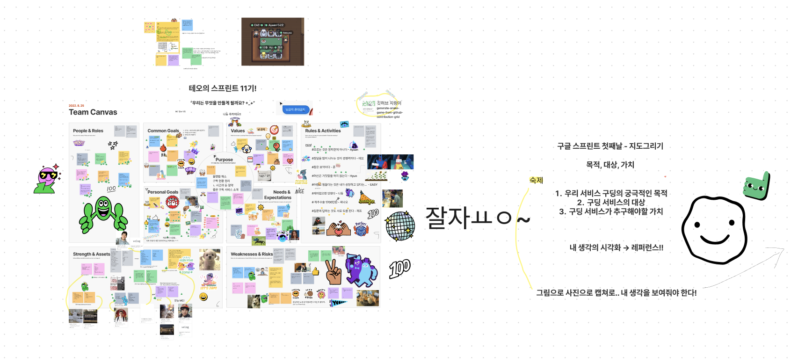

## 테오의 스프린트 11기 3조 - 구딩

테오의 스프린트 11기에 레프라는 닉네임으로 참여했다. 스프린트는 8월 24일 수요일부터 29일 월요일까지 약 6일간 진행되었다.

우리 3조는 **구딩**이라는 편하게 구독 관리를 할 수 있는 서비스를 만들었다. 구딩은 `구독+ing`를 귀엽게 표현한 것이다. 우리 팀은 이지, 현, 찌나오, 준, 아얀, 나동, 나 이렇게 프론트엔드 7명만 모여서 `Princess-Teo-And-The-Seven-Frontend`라는 팀명을 가지게 되었다. 프로젝트를 진행하면서 MC는 나동이, UIUX 최종결정권자는 찌나오가, PL은 아얀이 담당했다.

프로젝트 결과물은 [이곳](https://gooding.vercel.app/)에서 확인이 가능하고, 깃허브 레포지토리는 [이곳](https://github.com/Princess-Teo-And-The-Seven-Frontend/gooding)에서 확인이 가능하다.

 

## 전체적인 일정

첫 번째 날에는 준비해온 아이디어를 발표하고 투표를 통해 4개의 아이디어를 선정했다. 운 좋게 내가 생각했던 아이디어가 뽑혀서 7명이 진행하게 되었다. 각자 자기소개하고 목표 등에 대해 이야기를 나눴다.

두 번째 날에는 각자 레퍼런스를 찾아오고 지도를 그리는 시간을 가졌다. 우리 서비스의 목적, 대상, 가치 등에 대해 이야기를 나누면서 목표를 구체화했다. 그리고 `대상 - 목적 - 가치`를 연결하면서 최종적인 화면을 정할 수 있었다.

세 번째 날에는 화면을 디자인하고 [SDD와 BDD](https://velog.io/@teo/behavior-driven-development-schema-driven-development)를 통해 화면별로 어떤 데이터가 있고, 어떻게 바뀌며, 사용자가 어떤 행동을 할 수 있는지에 대해 정리했다. 최종적으로 우리 팀은 개발할 것을 화면별로 나눈 뒤 현업자 1명 + 취준생 1~2명끼리 묶어 분담했다.

그리고 주말 이틀과 월요일 발표 직전까지 개발했다. 각자 되는 시간에 맞춰서 자유롭게 개발했다.

월요일 오후 11시 15분 정도부터 데모가 시작되었다. 데모는 자유롭게 돌아다니면서 다른 조를 구경하는 방식으로 진행되었다. 다른 팀들 결과물을 설명과 함께 들으니 좋았다. 다들 너무 예쁘게 만들어서 사용해보는데 재밌었다.

데모가 끝나고는 회고 시간을 가졌다. 프로젝트, 팀, 개인 이렇게 3번에 걸쳐 좋았던 점, 배운 점, 아쉬웠던 점, 앞으로 발전할 점으로 나누어 생각했는데, 그래서 좀 더 다양하게 되짚어볼 수 있었다.

 

## 개발 과정에서 처음 해보고 배우고 느낀 점들

처음에는 프로젝트 자체가 중요하다고 생각했었는데 개발을 시작하니까 결과물도 결과물이지만 개발하는 과정에서 많이 배워보자는 쪽으로 마음이 바뀌었다. 이 스프린트 덕분에 개발하는 3일 동안 처음 해본 것들과 배우고 느낀 점들이 너무 많아서 추가로 정리하게 되었다.

### 처음 해본 것

- **페어 프로그래밍**을 해봤다. 페어 프로그래밍은 라이브쉐어를 통해 진행했었는데 나는 나동과 찌나오와 5분씩 돌아가면서 개발했었다. 토요일 저녁부터는 시간 관계상 각자 개발했지만 이후 7명이 모여서 동시에 이곳저곳 수정하며 에러를 해결하기도 했다.
- **코드 리뷰**를 해보고 받아봤다. 처음에는 무슨 말을 해야 할지 몰라서 주저했었는데 잘한 점을 말해도 된다는 말을 듣고 나서 마음 편하게 리뷰를 할 수 있었다. 뿐만 아니라 코드 리뷰를 요청하기 앞서서 내가 먼저 코드에 대한 설명을 적기도 한다는 말을 듣고는 내가 내 코드 이곳저곳을 리뷰했는데 그것도 재밌었다. 이 덕분에 내 깃허브 `Activity overview 그래프`의 `Code review`가 1%로 올랐다.
- **아토믹 디자인**으로 개발해봤다. 이 덕분에 컴포넌트 재사용의 편리함을 느낄 수 있었다.
- `eslint-config-airbnb`로 `eslint`를 꽤 빡세게 설정해서 코드를 작성해봤다. 한 줄에 130자가 넘어가면 에러가 발생한다는 게 솔직히 나로서는 믿기 어려운 일이었다. 그래도 한 줄 한 줄 에러를 잡아가니까 재밌었다. 마치 타입스크립트의 타입을 수정하면서 발생한 에러를 잡는 것과 유사했다. 이 프로젝트보다 린트 설정을 더 까다롭게 설정할 수 있다고 하는데 지금 설정이 익숙해질 때쯤 추가로 설정해보고 싶다.
- Pull Request 날린 다음에 리뷰 받고 나서 수정 후 머지를 해봤다. PR의 결과는 머지 또는 거절 둘 중 하나인 줄 알았는데, 코드 리뷰를 받는 PR 과정에서 수정할 수 있는 것을 처음 알았다.
- Pull Request의 Approve 기능을 사용해봤다.
- 깃모지를 사용해봤다. 제대로 이용한 것 같지는 않다… 제대로 이용하려면 `gitmoji -c`를 매번 이용했어야 했는데 익숙하지 않아서 그냥 이모지를 복붙하면서 커밋 메시지를 작성했다. 어쨌든 그 덕분에 커밋 메시지가 엄청 예뻐졌다.
- 절대 경로를 활용해봤다. 정말 너무 편리하고 좋았다. Next.js는 `cna`로 셋팅했기 때문에 `tsconfig.json` 안에 경로를 설정했다.
- VSCode의 `git graph`로 `git checkout`을 해봤다. 너무 편하고 너무 좋았다.
- markdown을 동시에 수정해봤다. 테오가 알려준 [사이트](https://hackmd.io/)를 통해 다같이 수정하는데 좋았다.
- 여러 명이 함께 커밋을 해봤다. 커밋메시지 다다음 줄부터 `Co-authored-by: ryuna <anottrx@gmail.com>`처럼 추가 작성하면 된다!
- 깃허브 organization의 Overview에서 찌나오가 예쁘게 만든 구딩 소개 이미지를 볼 수 있도록 `README.md`를 작성해봤다. 어떻게 작성하는지 몰라서 헤맸는데 `.github` 레포지토리를 생성하고 해당 레포지토리에서 작성된 `profile/README.md`가 organization 대표 `README.md`가 된다.
- `npx prettier -w **/*.tsx`, `npx prettier -w **/*.ts`로 `prettier`를 한번에 적용해봤다.

### 배운 점

- `hotfix`의 개념을 확실히 알게 되었다. `develop → main` 후 `main`에서 에러가 발생했을 때 `hotfix` 브랜치를 파서 에러를 수정한다. 브랜치 이동은 `main → hotfix → main → develop`으로 진행된다.
- Vercel 배포 결과를 매번 확인할 수 있다는 것을 알게 되었다. 배포하는 브랜치만 결과를 확인할 수 있는 줄 알았는데 아니었다.
- `import` 선언 순서에 대해 확실히 알게 되었다. `라이브러리 - 절대 경로 - 같은 디렉터리`가 일반적이라고 한다. 또 `eslint`로 `import` 속성 순서를 제어할 수 있다는 것도 배웠다.
- CSS `transform` 속성에 대해 배웠다. 데이터를 가운데 정렬할 때 사용했다.
- 하나만 더 해보자는 마음가짐을 배웠다. 월요일 오후 11시가 데모였는데 다들 마지막까지 하나만 더 수정해보자고 하면서 개발했다. 나는 수정했다가 에러가 날 수 있고 또 시간이 급해지면 머리가 안 돌아가서 안 하는 게 나을 것 같다고 생각했었는데 착각이었다. 11시 넘어서까지 수정을 계속했고 그 결과 더 완성도 있는 결과물이 나올 수 있었다.
- 타협하는 마음가짐을 배웠다. 위에 적은 하나만 더 해보자는 마음가짐과 정반대로 느낄 수 있지만 내가 느끼기엔 결이 조금 다르다. 금요일에 해야 할 것들을 최종으로 다 같이 정하면서 상대적으로 덜 중요한 것들은 쳐냈다. 또 개발하면서도 시간상 못할 것들은 쳐냈는데 그 덕분에 주요 기능은 모두 완성하여 그럴싸함을 보여줄 수 있었다.

### 아쉬웠던 점

- `rebase`를 정확히 이해하지 못한 점이 아쉽다. git 때문에 몇 시간 날린 적이 여러 번 있어서 `rebase` 같은 건 주저하게 되는 것 같다.
- CSS를 더 잘했으면 좋았을 것 같다. 특히 `react-reveal` 없이 개발했으면 더 좋았을 것이다.
- 린트 설정이 제대로 안 된 점이 아쉽다. VSCode 자체적인 설정과 프로젝트 설정이 충돌 난 문제였다.
- 자주 사용하는 타입, 색상이나 `import` 선언 순서 등에 대해 이야기를 미리 나누고 코드 리뷰를 좀 더 많이 했으면 좋았을 것 같다. 그런데 개발 기간이 짧아서 이게 최선이었다고 생각한다.
- 그리고 게더타운이 예쁘게 꾸며져 있었는데 구경 못한 게 아쉽다.

### 느낀 점

- Pull Reqeust는 정신 차리고 진행해야 한다는 걸 느꼈다. 실제로 내가 `develop → main`이 아닌 `main → develop`으로 머지 실수할 뻔 했다… 나는 머지 후 무조건 브랜치를 지우는 편인데 앞으로는 확실한 브랜치만 지우기로 했다. 그리고 Pull Reqeust 열 때는 방향이 제대로 되었는지 무조건 소리 내서 읽어봐야겠다.
- 어렵다고 생각한 게 생각보다 쉬울 수도 있다는 것을 느꼈다. `sweetalert`를 여러 프로젝트에서 적용했었는데 메서드로 묶어서 리팩터링을 하면 좋겠다는 생각을 매번 했었지만 에러가 발생할까 봐 하지는 않았다. 그런데 새벽에 이지가 먼저 같이 리팩터링하자고 해서 진행했었는데 정말 간단하게 해결되었다.
- `git` 브랜치 전략에선 절대적인 건 없다는 걸 느꼈다. `develop → feat`은 언제나 새로운 브랜치를 생성할 때만 하는 줄 알았는데 아니었다.
- 가독성이 좋고 이유 있는 코드를 작성해야 한다는 것을 느꼈다. 내가 작성한 코드를 남에게 설득력 있게 설명하려면 내가 알아보기 쉬워야 하고, 의미가 있어야 한다.
- 혼자서 하는 것은 한계가 있다는 걸 새삼 느꼈다. 코드 리뷰나 PR 규칙에 대해서 대강 알고는 있었지만 혼자서라면 제대로 못 했을 것이다.
- 디자인은 절대 내 영역이 아니란 걸 다시 느꼈다.
- 코딩테스트 대비하는 알고리즘 공부가 개발할 때 종종 사용되는 것 같다.

 

## 추가로

- **회고글**을 작성해보고 싶었는데 드디어 작성하게 되었다!
- 매일 새벽 2시 넘어서 일정이 끝났는데 함께한 현업자분들이 대단하다고 생각했다. 내가 현업에서 일하게 되어도 이런 사이드 프로젝트에 참여할 수 있을까? 그러면 좋겠다.
- 이번 스프린트에서 제일 인상적이었던 것은 **그럴싸함**의 중요성이었다. 만들다가 만 것처럼 보이지 않도록 하는 것이 바로 그럴싸함이다. 기능이 완성이 안 되면 버튼을 숨기던가 추후 개발 예정이라고 하거나 유료 서비스(!)라고 적는 방법, `README.md` 문서 작업, 아이콘 로고 등 다양한 방식이 있다. 이처럼 그럴싸함을 앞으로도 잊지 말고 여러 군데에 적용해야겠다.

 

## 앞으로

이런저런 이유로 스프린트에 참여할지 고민을 많이 했었다. 막상 하고 나니 참여하길 잘했다는 생각이 들었다. 이제 스프린트는 끝났고 다시 공부하고 있다. 스프린트에서 배우고 느낀 점들을 바탕으로 개발을 계속해볼 예정이다.

 
 
